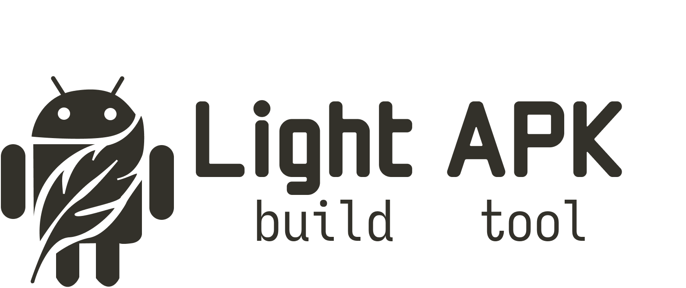

<div align="center">
  <picture>
    <source media="(prefers-color-scheme: lignt)" srcset="./images/light_apk_logo_dark.png" width="600px">
    <source media="(prefers-color-scheme: dark)" srcset="./images/light_apk_logo.png" width="600px">
    
  </picture>
</div>

# Light APK build tool

Light APK is a fast, lightweight build tool for android native apps,
that relies on android SDK & NDK to Compile,package and sign the app into an APK

# Requirements
using `light_apk` requires android-commandline-tools to be installed.\
`ANDROID-SDK & ANDROID-NDK`

# Usage:

```sh
light_apk <command>
```
## commands

- ### init
    Run it in an empty directory to generate the starting template for and native android app
- ### build
    Run to:
    - build the C/C++ code to `.so` binary.\
    - package into an `unsigned.app.apk`
    
- ### sign <key-store>
    Run to:
    - align the `unsigned.app.apk` into `aligned.app.apk`
    - sign the `aligned.app.apk` into `signed.app.apk`

